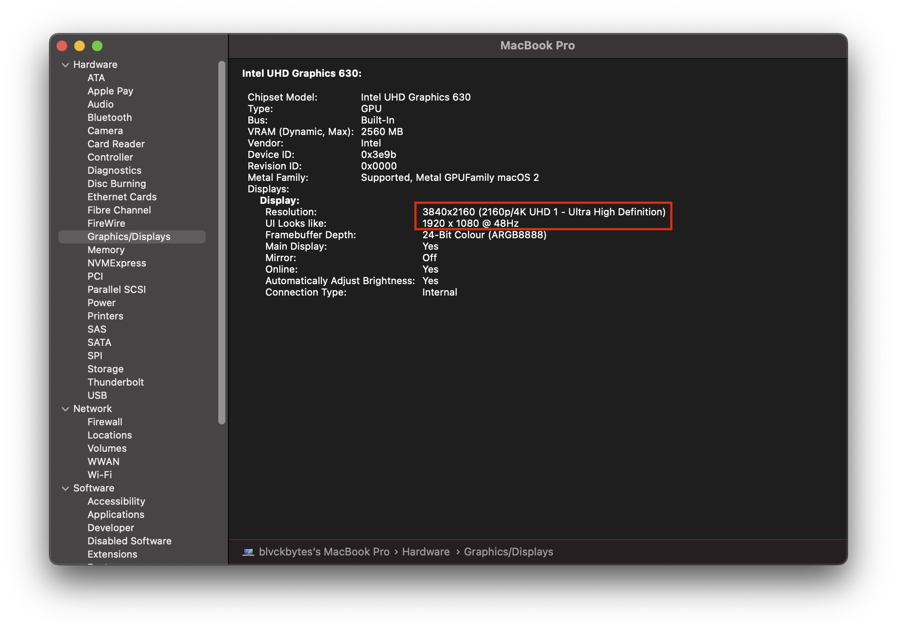
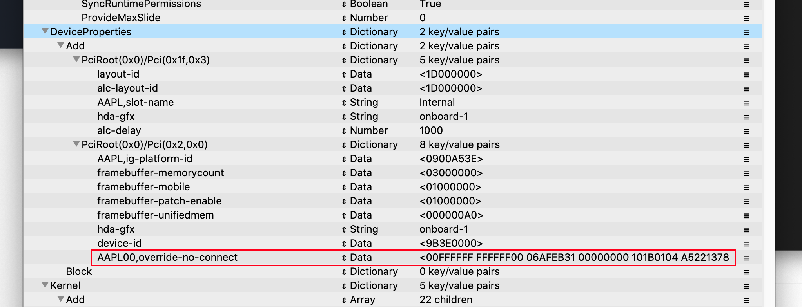

# EDID-RefreshRate-Patcher
Used to generate a hotpatch for your built-in screen's EDID to lower it's refresh-rate. Needed for 4K panels.

## Problem
With the release of the macOS Big Sur operating system, some patches we hackintoshers use broke. WhateverGreen's -cdfon patches work in userspace, which is currently unsupported. We need to wait for a new release of this kext, which then hopefully transfers the patch to kernelspace. In order to still get an image, the refresh rate needs to be lowered from 60Hz to 48Hz. This is a hack, and only something to get you into Big Sur as fast as possible, while we wait on acidanthera's work.

## Solution
The patcher.py is able to parse the output of `xrandr --props` and then patch the EDID found in there. If there are multiple EDIDs, it will offer you a prompt. You should never get this prompt if you disconnect all external monitors before dumping this information tho (except your laptop has multiple screens built in). So, please make your life easier and disconnect them beforehand.

### Dumping

I used Manjaro KDE Plasma for this step, which I think is one of the best and easiest options available. I downloaded it from [the official page](https://manjaro.org/downloads/official/kde/), then created a bootable USB using [balena etcher](https://www.balena.io/etcher/). Boot the usb, then just open a terminal and type `sudo /bin/bash` to get yourself a root-shell.

The goal is to get the full output of `xrandr --props` into a file and then copied onto your macOS disk. The file needs to have the name `display_info.txt`, you can create it like this: `xrandr --props > display_info.txt`. I just put it on my EFI partition, which is then easily accessible from macOS, like this:

```
[manjaro /]# lsblk
NAME        MAJ:MIN RM   SIZE RO TYPE MOUNTPOINT
loop0         7:0    0  20.8M  1 loop /run/miso/sfs/livefs
loop1         7:1    0 570.1M  1 loop /run/miso/sfs/mhwdfs
loop2         7:2    0   1.6G  1 loop /run/miso/sfs/desktopfs
loop3         7:3    0 630.2M  1 loop /run/miso/sfs/rootfs
sda           8:0    1 119.3G  0 disk /run/miso/bootmnt
├─sda1        8:1    1   2.9G  0 part 
└─sda2        8:2    1     4M  0 part 
nvme0n1     259:0    0   1.8T  0 disk 
├─nvme0n1p1 259:1    0   200M  0 part 
├─nvme0n1p2 259:2    0 931.4G  0 part 
└─nvme0n1p3 259:3    0 931.4G  0 part   
[manjaro /]# mount /dev/nvme0n1p1 /mnt
[manjaro /]# cd /mnt
[manjaro mnt]# xrandr --props > display_info.txt 
[manjaro mnt]# cd ..
[manjaro /]# umount /dev/nvme0n1p1
```

Just mount it and then write the file onto the partition. As stated, copy it how you like to. You just need to end up with the file on macOS.

### Patching

Boot back into macOS. Now, copy this file to the location where `patcher.py` resides. Then, just execute the patcher, using python inside the terminal. The output will look like this:

```
Patched your EDID!
Please add it to DeviceProperties/Add/PciRoot(0x0)/Pci(0x2,0x0) like this:
Create a new entry: AAPL00,override-no-connect (with type data)
And set the value to:

00FFFFFFFFFFFF0006AFEB3100000000101B0104A522137802CEB5A65434B6250E505400000001010101010101010101010101010101A6A600A0F0703E803020350058C110000018000000000000000000000000000000000018000000FE0041554F0A202020202020202020000000FE00423135365A414E30332E31200A00BD
```

I have added my `display_info.txt` to this repo too, so you can check out what you're looking for. The above output tells you exactly what you need to do. Open your `config.plist` inside ProperTree, go to devices, your 0x2/0x0 device (IGPU) and add a new property called `AAPL00,override-no-connect` with a value of type data. Then, paste the full hex string into the value of that new entry.

### Conclusion

You should now be able to boot the Big Sur installer and get an image. As stated, this is only a hack to get you up and running for now, please keep an eye on new WhateverGreen releases.

You can see that the refresh-rate got applied:


And this is how the new entry looks like:

